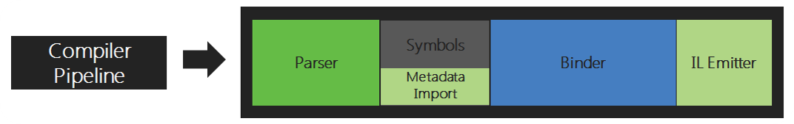
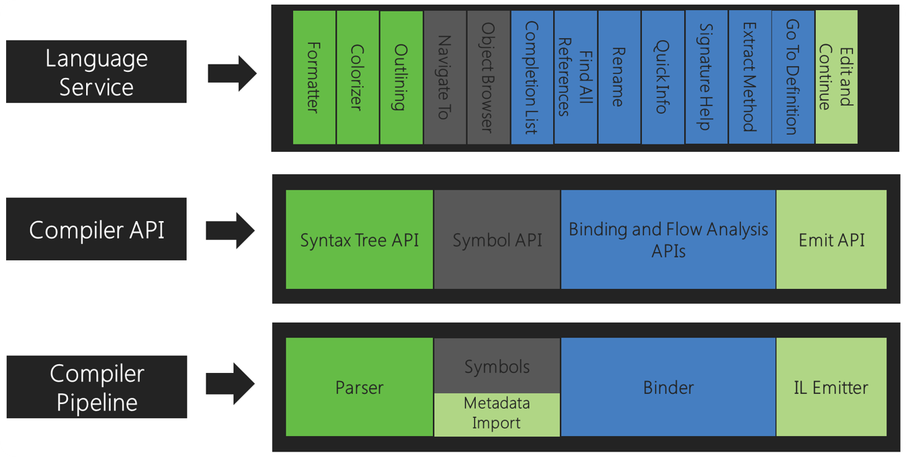

<!-- section start -->
<!-- attr: {class: 'slide-title', hasScriptWrapper: true} -->
# .NET Compiler Platform
## What is Roslyn and how can we use it?
<div class="signature">
    <p class="author-name">Ivan Ivanov</p>
    <p class="author-job-title">Junior Web Developer</p>
    <a href="http://csyntax.net" class="author-website">csyntax.net</a>
</div>

<!-- section start -->
# Table of Contents
* What is "Roslyn"?
  * Exposing the compiler
  * Pipeline
  * API layer
* Working with syntax
  * Trees, Nodes
  * Tokens, Trivia
* Semantics
  * Compilation
  * Semantic model

<!-- section start -->
<!-- attr: {  class:'slide-section', showInPresentation: true, hasScriptWrapper: true } -->
# What is "Roslyn"?


<!-- attr: {showInPresentation: true, hasScriptWrapper: true } -->
# What is "Roslyn"?
* Normal compiler – traditionally black box
  * Source code in
  * Magic in between
  * Assemblies out
* Nowadays we use
  * Intellisense
  * Refactoring
  * Code productivity tools

<!-- attr: {showInPresentation: true, hasScriptWrapper: true } -->
# Compiler's Pipeline
Traditional compiler pipeline
- **Parser** – parses text to syntax objects
- **Symbols/Metadata** – declarations are collected
- **Binder** – identifiers, code flow bind to symbols
- **IL Emitter** – IL assembly creation


<!-- attr: {showInPresentation: true, hasScriptWrapper:'False' } -->
# Compiler's Pipeline
Each phase now has corresponding API


<!-- section start -->
<!-- attr: {  class:'slide-section', showInPresentation: true, hasScriptWrapper: true } -->
# Working With Syntax
## The Grammar Nazi of Programming


<!-- attr: { showInPresentation: true, hasScriptWrapper: true } -->
# Working With Syntax
* **Why** – without text processing tools can:
  * See the structure of the source code
  * Create and rearrange source code
* **Contains**
  * Syntax Trees
  * Syntax Nodes
  * Syntax Tokens
  * Syntax Trivia
  * Spans and Kinds

<!-- attr: { showInPresentation: true, hasScriptWrapper: true } -->
# Syntax Trees
* Primary structure for compilation
* Hold all the source information
  * Constructs
  * Tokens
  * Everything!
* Two-way communication with the source text
* Immutable and thread-safe
* Contains **Nodes**, **Tokens**, **Trivia**

<!-- attr: { showInPresentation: true, hasScriptWrapper: true } -->
# Syntax Trees
* Syntax Trees

```cs
var code = File.ReadAllText("Code.cs");
var tree = SyntaxFactory.ParseSyntaxTree(code);
```

* Useful members
 * GetRoot()
 * GetText()
 * GetChanges()
 * Options

<!-- attr: {showInPresentation: true, hasScriptWrapper: true } -->
# Syntax Nodes
* Syntax Nodes
  * Primary element of Syntax Tree
  * Represents
  * Declarations
  * Statements
  * Clauses
  * Expressions
* Each node has children – other nodes and tokens

<!-- attr: {showInPresentation: true, hasScriptWrapper: true } -->
# Syntax Nodes
```cs
var localDeclarationNodes = tree.GetRoot()
	  .DescendantNodes()
	  .OfType<LocalDeclarationStatementSyntax>();
```
* Useful members
  * Modifiers
  * Type
  * Parent
  * DescendantNodes()

<!-- attr: {showInPresentation: true, hasScriptWrapper: true } -->
# Syntax Tokens
* Smallest syntactic fragment – no children
* Represents
  * Keywords
  * Identifiers
  * Literals
  * Punctuation

```cs
var tokens = node.ChildTokens();
var token = tokens.First();

token.Value;
```

<!-- attr: {showInPresentation: true, hasScriptWrapper: true } -->
# Syntax Trivia, Spans, Kind
* Syntax Trivia
  * Whitespace, comments, etc.
* Spans
  * Position and number of characters within the source code
* Kinds
  * Identifies the exact syntax element represented
* Errors
  * Missing tokens or skipped tokens

<!-- section start -->
<!-- attr: {  class:'slide-section', showInPresentation: true, hasScriptWrapper: true } -->
# Compilation
## Let's build something

<!-- attr: { showInPresentation: true, hasScriptWrapper: true } -->
# Compilation

* Compilation needs
  * Syntax Tree
  * Compilation Options
  * File Reference

```cs
var options = new CSharpCompilationOptions(OutputKind.DynamicallyLinkedLibrary);
var reference = new MetadataFileReference(typeof(object).Assembly.Location);
var compilation = CSharpCompilation.Create("Test")
    .WithOptions(options)
    .AddSyntaxTrees(tree)
    .AddReferences(reference);
```

<!-- attr: {showInPresentation: true, hasScriptWrapper: true } -->
# Semantic Model

* Additional semantic information for source code
* Symbols at specific location
* Resultant type of any expression
* Errors and warnings
* Variable flow in and out of source parts
* Answer to everything – 42?

<!-- attr: {showInPresentation: true, hasScriptWrapper: true } -->
# Semantic Model Example

```cs
var comp = CreateCompilation(tree, options, reference);
var model = comp.GetSemanticModel(tree);

var localDeclarationNodes = tree.GetRoot()
  .DescendantNodes()
  .OfType<LocalDeclarationStatementSyntax>();

foreach (var node in localDeclarationNodes)
{
  var info = model.GetTypeInfo(node.Declaration.Type);
  Console.WriteLine("{0} {1}", info.Type, node.Declaration);
}
```

<!-- section start -->
<!-- attr: {  class:'slide-section', showInPresentation: true, hasScriptWrapper: true } -->
# Emitting
## Actually use the code

<!-- attr: {showInPresentation: true, hasScriptWrapper:'False' } -->
# Emitting
* Using the dynamically compiled result
  * Emit to memory stream
  * Load assembly from byte array
  * Use with normal reflection

```cs
using (var memory = new MemoryStream())
{
   compilation.Emit(memory);

   var assembly = Assembly.Load(memory.GetBuffer());
   var type = assembly.GetType("NameOfType");
   var instance = Activator.CreateInstance(type);
}
```

<!-- section start -->
<!-- attr: {  class:'slide-questions', showInPresentation: true, hasScriptWrapper: true } -->
# Finish
## Thath is all
